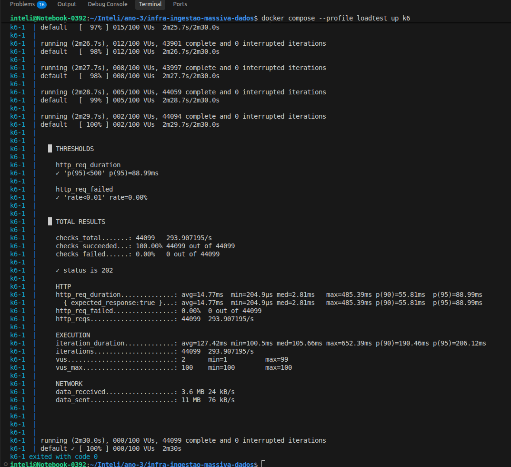
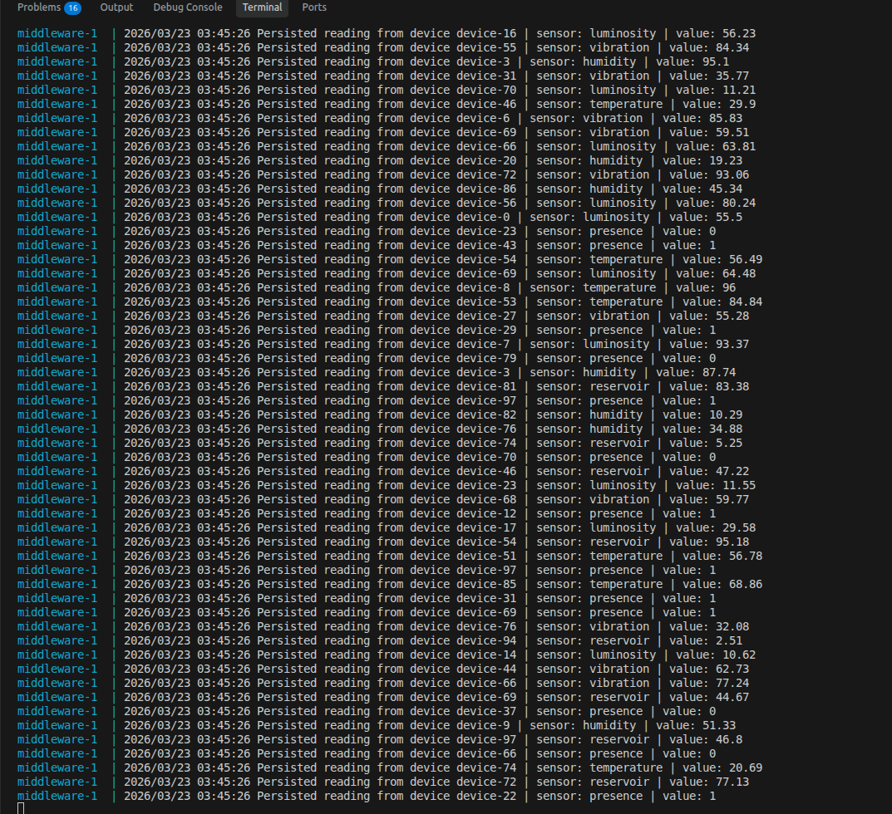
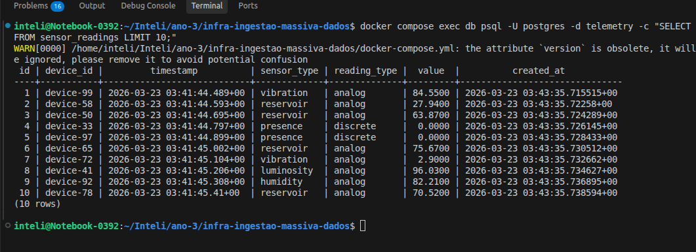
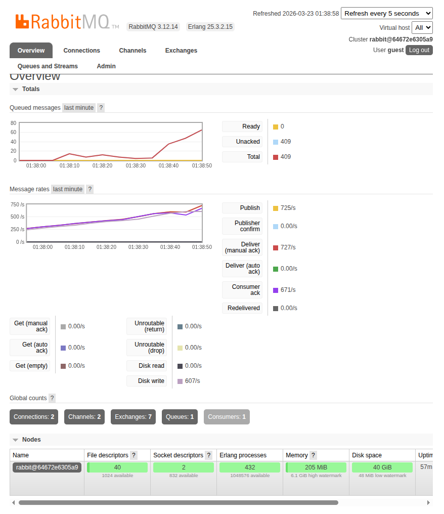
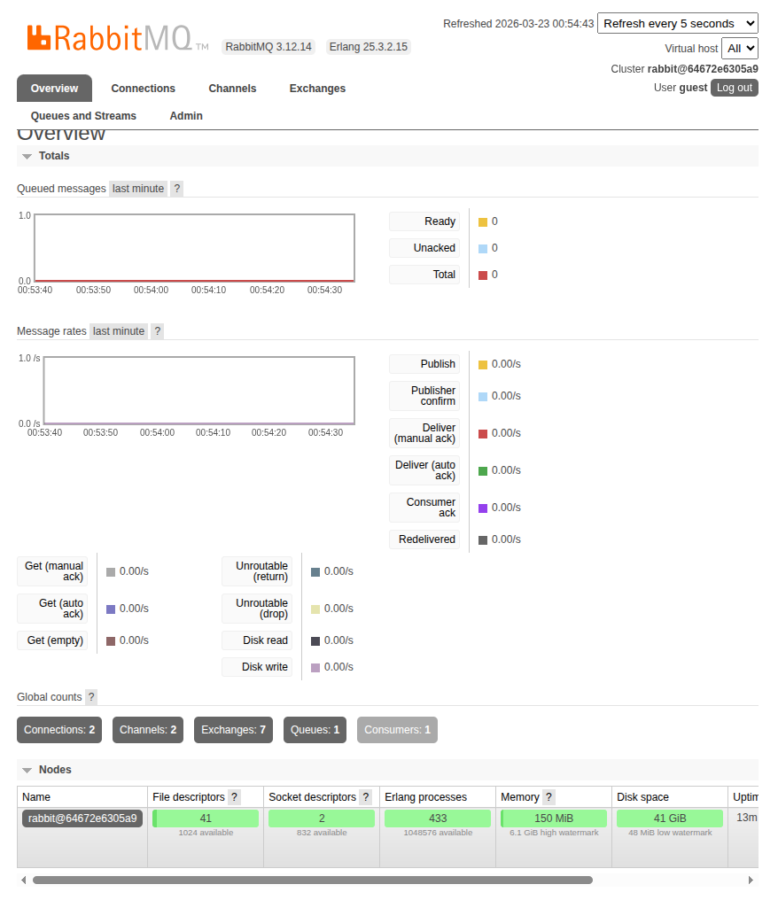

# Ponderada - Sistema de Monitoramento Industrial

Backend de telemetria para dispositivos embarcados, com arquitetura assíncrona baseada em mensageria.

## Arquitetura

```
Dispositivo → POST /telemetry → Backend (Go/Gin) → RabbitMQ → Middleware (Consumer) → PostgreSQL
```

Cada serviço roda em um container isolado com limites de CPU e memória definidos para garantir reprodutibilidade nos testes de carga.

## Serviços

| Serviço    | Tecnologia              | CPU  | RAM   |
|------------|-------------------------|------|-------|
| backend    | Go + Gin                | 0.5  | 256MB |
| rabbitmq   | RabbitMQ 3.12           | 1.0  | 512MB |
| middleware | Go (consumer)           | 0.5  | 256MB |
| db         | PostgreSQL 15           | 0.5  | 512MB |

## Pré-requisitos

- Docker
- Docker Compose v2

## Como executar

### Subir o ambiente completo

```bash
docker compose up --build
```

### Verificar se está rodando

```bash
docker compose ps
```

### Testar o endpoint manualmente

```bash
curl -X POST http://localhost:8080/telemetry \
  -H "Content-Type: application/json" \
  -d '{
    "device_id": "device-001",
    "timestamp": "2024-01-01T12:00:00Z",
    "sensor_type": "temperature",
    "reading_type": "analog",
    "value": 23.5
  }'
```

Resposta esperada:
```json
{"status": "enqueued"}
```

### Verificar dados no banco

```bash
docker compose exec db psql -U postgres -d telemetry -c "SELECT * FROM sensor_readings LIMIT 10;"
```

### Acessar painel do RabbitMQ

Abra [http://localhost:15672](http://localhost:15672) no navegador.
- Usuário: `guest`
- Senha: `guest`

## Teste de Carga (k6)

O teste simula múltiplos dispositivos enviando leituras simultaneamente com carga crescente:

- **0–30s**: rampa de 0 a 10 usuários virtuais
- **30s–1m30s**: sustentado em 50 usuários virtuais
- **1m30s–2m**: pico de 100 usuários virtuais
- **2m–2m30s**: rampa de descida

### Executar o teste de carga

```bash
docker compose --profile loadtest up k6
```

### Thresholds definidos

| Métrica             | Critério              |
|---------------------|-----------------------|
| `http_req_duration` | p95 < 500ms           |
| `http_req_failed`   | taxa de erro < 1%     |

## Payload do endpoint

`POST /telemetry`

```json
{
  "device_id":    "string (obrigatório)",
  "timestamp":    "ISO 8601 (obrigatório)",
  "sensor_type":  "temperature | humidity | presence | vibration | luminosity | reservoir",
  "reading_type": "analog | discrete",
  "value":        0.0
}
```

## Tipos de sensores suportados

| Sensor       | Tipo de leitura | Exemplo de valor |
|--------------|-----------------|------------------|
| temperature  | analog          | 23.5             |
| humidity     | analog          | 65.2             |
| presence     | discrete        | 0 ou 1           |
| vibration    | analog          | 0.34             |
| luminosity   | analog          | 820.0            |
| reservoir    | analog          | 78.9             |

## Modelo de dados

```sql
CREATE TABLE sensor_readings (
    id           SERIAL PRIMARY KEY,
    device_id    VARCHAR(100)  NOT NULL,
    timestamp    TIMESTAMPTZ   NOT NULL,
    sensor_type  VARCHAR(50)   NOT NULL,
    reading_type VARCHAR(20)   NOT NULL CHECK (reading_type IN ('analog', 'discrete')),
    value        NUMERIC(12,4) NOT NULL,
    created_at   TIMESTAMPTZ   NOT NULL DEFAULT NOW()
);
```

## Trechos gerados com auxílio de IA

Conforme exigido pelo enunciado, os trechos produzidos com auxílio de IA estão marcados com comentário `// (IA)` no código:

- `back/queue/rabbitmq.go` — retry logic de conexão com RabbitMQ
- `middleware/consumer/consumer.go` — retry logic de conexão com RabbitMQ
- `middleware/main.go` — retry logic de conexão com PostgreSQL
- `loadtest/load_test.js` — configuração de cenários de carga crescente

## Parar o ambiente

```bash
docker compose down

# Para remover também os volumes (apaga os dados do banco)
docker compose down -v
```

---

## Relatório de Execução e Análise dos Testes

### Ambiente de execução

Os testes foram executados com todos os containers ativos simultaneamente, cada um com os limites de recursos definidos no `docker-compose.yml`. Essa restrição é intencional: garante que os resultados sejam reproduzíveis independentemente da máquina host e simula um ambiente com recursos controlados, próximo de um cenário de produção com cotas definidas.

---

### Resultado do teste de carga (k6)



| Métrica                   | Valor obtido  | Threshold definido | Status  |
|---------------------------|---------------|--------------------|---------|
| `http_req_duration p(95)` | 88.99ms       | < 500ms            | ✅ PASS |
| `http_req_failed`         | 0.00%         | < 1%               | ✅ PASS |
| Total de requisições      | 44.099        | —                  | —       |
| Throughput                | ~293.9 req/s  | —                  | —       |
| Duração do teste          | 2m30s         | —                  | —       |
| VUs máximos               | 100           | —                  | —       |

**Interpretação:**

O sistema processou 44.099 requisições em 2 minutos e 30 segundos com taxa de erro zero. O p95 de latência ficou em 88.99ms — bem abaixo do threshold de 500ms — indicando que 95% dos dispositivos receberam resposta em menos de 89ms mesmo no pico de 100 usuários virtuais simultâneos.

A latência média de 14.77ms e mediana de 2.81ms revelam uma distribuição assimétrica: a grande maioria das requisições foi atendida muito rapidamente, com alguns outliers elevando a média. O valor máximo de 485ms ocorreu provavelmente durante a fase de pico (100 VUs), mas ainda dentro do threshold.

O throughput de ~294 req/s é expressivo considerando que o backend estava limitado a 0.5 CPU e 256MB de RAM. Esse resultado demonstra a eficiência da arquitetura assíncrona: o endpoint não bloqueia em processamento, apenas enfileira e responde imediatamente.

---

### Middleware consumindo a fila



Os logs confirmam que o middleware consumiu e persistiu corretamente todas as leituras enfileiradas pelo backend. É possível observar a diversidade de dispositivos (`device-0` a `device-99`), tipos de sensores (`temperature`, `humidity`, `presence`, `vibration`, `luminosity`, `reservoir`) e valores condizentes com cada tipo — incluindo `0` e `1` para leituras discretas de presença.

O fato de múltiplas leituras aparecerem com o mesmo timestamp (`03:45:26`) confirma que o sistema processava em alta concorrência, com o middleware consumindo mensagens em rajadas após o pico de enfileiramento.

---

### Dados persistidos no PostgreSQL



A query `SELECT * FROM sensor_readings LIMIT 10` confirma a persistência correta dos dados. Pontos observados:

- Os campos `timestamp` e `created_at` apresentam diferença de tempo entre si: o `timestamp` representa o momento em que o dispositivo coletou a leitura, enquanto o `created_at` é o momento da persistência no banco — evidenciando o delay assíncrono esperado da arquitetura.
- O campo `reading_type` está preenchido corretamente: `analog` para sensores contínuos e `discrete` para presença, com valor `0.0000`, compatível com o tipo numérico da coluna.
- Os IDs são sequenciais e sem lacunas, indicando que nenhuma mensagem foi perdida ou rejeitada durante o consumo.

---

### Painel do RabbitMQ — durante o teste



O painel capturado **durante a execução do k6** revela o comportamento do broker sob carga:

- **Publish: 725/s** — o backend estava enfileirando 725 mensagens por segundo no pico
- **Deliver (manual ack): 727/s** — o middleware consumia praticamente na mesma taxa
- **Consumer ack: 671/s** — confirmações de persistência no banco em ~671/s
- **Unacked: 409** — mensagens em voo naquele instante, não acúmulo

O dado mais relevante é a paridade entre Publish (~725/s) e Deliver (~727/s): o middleware acompanhou o producer em tempo real, sem acúmulo na fila. Os 409 Unacked representam apenas mensagens em processamento naquele frame de captura, não um backlog crescente. A ausência de `Redelivered` e `Unroutable` confirma que não houve falhas de roteamento nem reprocessamento por erro.

### Painel do RabbitMQ — após o teste



Com o k6 encerrado, o painel mostra o estado de repouso do broker:

- **Ready: 0 / Unacked: 0 / Total: 0** — fila completamente drenada, nenhuma mensagem pendente
- **Connections: 2 / Channels: 2** — uma conexão do backend (producer) e uma do middleware (consumer)
- **Consumers: 1** — middleware ativo durante todo o ciclo
- **Memory: 150 MiB** — dentro do limite de 512MB com folga

A comparação entre os dois painéis ilustra o ciclo completo: durante o teste, o sistema operou a ~725 msg/s com producer e consumer pareados; após o teste, a fila esvaziou completamente, sem resíduos.

---

### Possíveis gargalos identificados

**1. Single consumer no middleware**

O middleware roda com uma única goroutine de consumo. Em cenários com volume muito maior (ex: 1000+ req/s sustentados), a velocidade de persistência no banco pode não acompanhar o ritmo de enfileiramento, causando acúmulo progressivo na fila. A solução seria aumentar o `prefetch count` e processar mensagens em paralelo com múltiplas goroutines.

**2. Pool de conexões com o banco não configurado explicitamente**

O `database.go` usa `sql.DB`, que gerencia um pool internamente, mas sem configuração explícita de tamanho máximo e timeout. Em alta carga, isso pode gerar contenção nas conexões disponíveis. A melhoria seria configurar `db.SetMaxOpenConns`, `db.SetMaxIdleConns` e `db.SetConnMaxLifetime`.

**3. Ausência de idempotência no INSERT**

Se o broker reiniciar durante o consumo, mensagens com status `Unacked` podem ser reenfileiradas e processadas duas vezes, gerando duplicatas no banco. A solução completa exigiria idempotência no `INSERT` via constraint de unicidade por `device_id + timestamp`, rejeitando silenciosamente inserções duplicadas.

**4. Escalabilidade horizontal do backend**

Com 0.5 CPU, o backend atingiu ~294 req/s. Em um cenário real com dezenas de milhares de dispositivos, seria necessário escalar horizontalmente com múltiplas réplicas do backend atrás de um load balancer. O RabbitMQ suporta isso nativamente, pois é um broker centralizado que múltiplos producers podem publicar simultaneamente.

---

### Conclusão

A arquitetura assíncrona baseada em mensageria demonstrou ser eficaz para absorver picos de carga sem perda de dados. O desacoplamento entre recebimento (backend) e processamento (middleware) permitiu que o endpoint respondesse rapidamente mesmo sob alta concorrência, enquanto a persistência ocorria de forma independente e confiável. Todos os thresholds definidos foram atingidos com margem, a fila foi completamente drenada ao final do teste, e os dados estão íntegros no banco — validando a proposta da arquitetura.